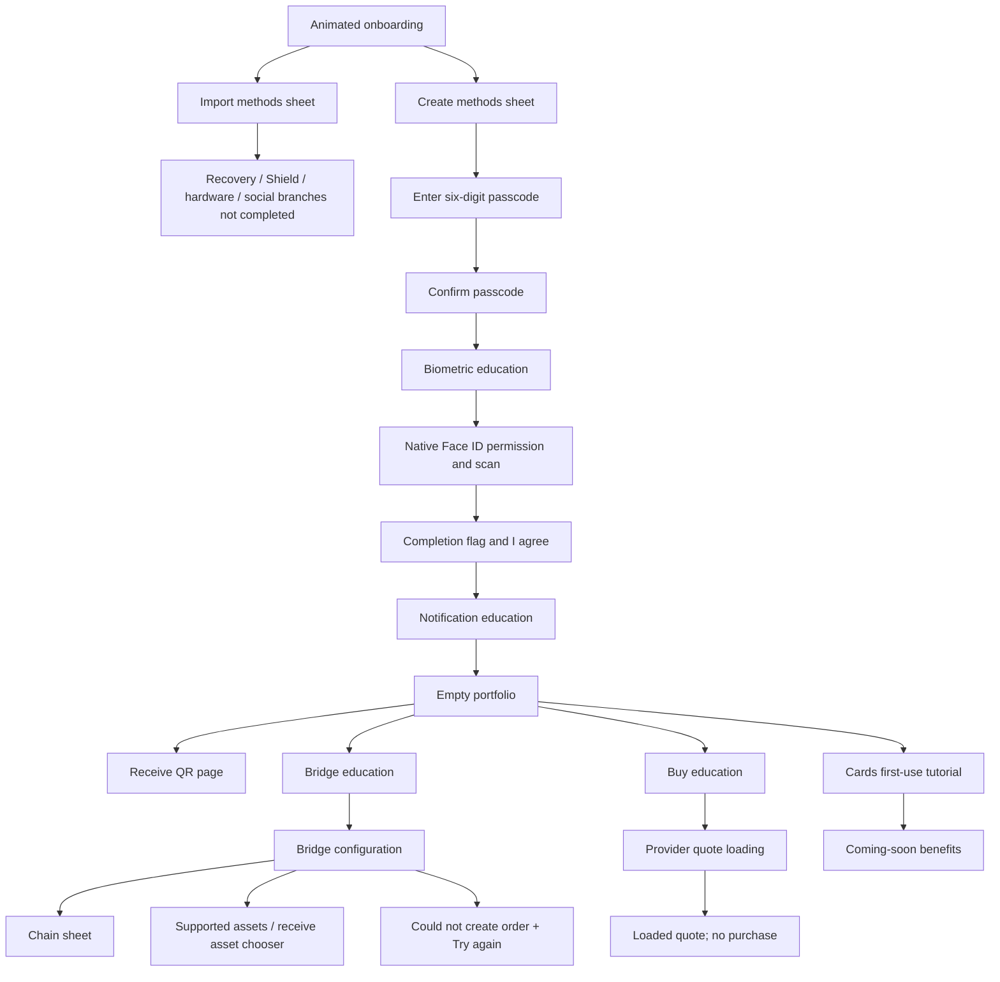

# R1 — Solflare

[Study index](README.md) · [Evidence gallery](gallery.html) · [Source metadata](evidence/R1/metadata.json)

Solflare is the strongest reference for an onboarding story that combines changing color fields, layered cards, reflective 3D assets, and persistent calls to action. Its authenticated surfaces are quieter: dark backgrounds, yellow accents, compact data cards, and four fixed tabs.

## Complete timeline

Times are approximate source-relative seconds. Each evidence link opens a retained frame.

| Time | Screen / action | Visible behavior and state | Evidence |
|---|---|---|---|
| 00–07 | iPhone search and launch | Low-power alert and home/search content precede the app. Exclude these from product onboarding. | Overview masks unrelated content |
| 07–15 | Splash | Centered yellow Solflare mark on black. The long hold includes startup time; it is not an eight-second animation requirement. | [Overview 1](evidence/R1/overview-01.jpg) |
| 15–33 | Six onboarding panels | Rounded colored canvas, segmented progress, oversized layered artwork, title/copy, fixed yellow Get started and dark Import existing wallet buttons. Horizontal panel changes; ambient artwork keeps moving. | [S01](evidence/R1/screens/S01.jpg)–[S06](evidence/R1/screens/S06.jpg), [M01](evidence/motion/M01.mp4) |
| 33.5–37 | Import options | Bottom sheet with drag handle, recovery phrase, Shield recovery, hardware wallet, OR divider, Google and Apple. Background dims; its onboarding carousel keeps changing behind the sheet. No import completed. | [S07](evidence/R1/screens/S07.jpg), [M02](evidence/motion/M02.mp4) |
| 37–41 | Create options | Create new wallet, Create with Solflare Shield, OR divider and social choices. Primary option is visually dominant. | [S08](evidence/R1/screens/S08.jpg) |
| 42–47 | App-switcher detour | Telegram/system detour; not Solflare navigation. Returns to the app. | Excluded in retained overview |
| 47–53 | Revisit onboarding/create | Previously seen selection surfaces are revisited before passcode entry. Exact account creation internals are not shown. | [Overview 1](evidence/R1/overview-01.jpg) |
| 53–57 | Set and confirm passcode | Six masked dots, custom round digit keys and delete control. Six entered digits advance to confirmation; successful confirmation advances. No mismatch is recorded. | [S09](evidence/R1/screens/S09.jpg), [S10](evidence/R1/screens/S10.jpg) |
| 57.5–59.5 | Unlock quicker | Animated white lock; Enable biometrics and Not now choices. | [S11](evidence/R1/screens/S11.jpg) |
| 59.5–62.5 | Face ID | Native iOS permission followed by scan/check feedback near the Dynamic Island. App splash is behind it. | [S12](evidence/R1/screens/S12.jpg) |
| 62.7–64 | Completion | “You're all set,” animated silver flag, terms footnote, yellow I agree. Flag flexes and catches changing highlights. | [S13](evidence/R1/screens/S13.jpg), [M18](evidence/motion/M18.mp4) |
| 64–65.5 | Notifications education | Bell imagery, “Don't miss out,” Enable notifications and Not now. The recording reaches home; a native notification dialog is not clearly captured here. | [S14](evidence/R1/screens/S14.jpg) |
| 65.5–69 | Empty portfolio | Textured dark balance card, Main Wallet, $0, copy affordance and ellipsis with a yellow dot. Empty-portfolio education plus Add funds, Bridge, Buy crypto action rows; markets below. | [S15](evidence/R1/screens/S15.jpg) |
| 69–72 | First Cards visit | Full-page introduction: black card art and Next, then “New home for Settings” illustration and Got it. The illustrated ellipsis menu is tutorial content, not an opened real menu. | [S16](evidence/R1/screens/S16.jpg), [S17](evidence/R1/screens/S17.jpg), [M03](evidence/motion/M03.mp4) |
| 72–74.5 | Cards landing | Coming-soon card hero with moving 3D consumer/card imagery; Travel for less, Borrow USDC, Virtual accounts benefit tiles. No card issuance or spending. | [S18](evidence/R1/screens/S18.jpg) |
| 75–77 | Explore | Search/URL bar, browser tab counter, green rewards banner with dots and dismissal, cashback brands, feed. No external dApp opened. | [S19](evidence/R1/screens/S19.jpg) |
| 78–82 | Market | Stock tiles, competition promotion, empty watchlist, Trending and asset categories. Scroll reaches explanatory/disclaimer content. | [S20](evidence/R1/screens/S20.jpg) |
| 83–90 | Portfolio → Receive | Receive page pushes from the right. A white particle/dot QR resolves into its final code. Wallet label and truncated address, Solana-only warning, Copy and Share. Buttons are visible but their results are not recorded. | [S21](evidence/R1/screens/S21.jpg), [M04](evidence/motion/M04.mp4) |
| 91–94 | Bridge education → configuration | White bridge illustration and four explanation rows lead to configuration. Source Ethereum, supported-assets row, destination SOL, direction arrow, fee/time/QR loading regions, transfer-requirements warning. | [S22](evidence/R1/screens/S22.jpg), [S23](evidence/R1/screens/S23.jpg) |
| 95–97 | Choose chain | Nested choice sheet; Ethereum checked, Bitcoin, BNB Chain, Arbitrum, Base, Polygon, Tron with recognizable chain marks. Base uses a square variant in this recording. Unresolved token discs appear later in S27, not here. | [S24](evidence/R1/screens/S24.jpg) |
| 98–101 | Bridge error and supported assets | Red “Couldn't create order,” explanatory recovery copy and Try again. Supported assets page includes amber warning and asset rows. A successful bridge deposit/order is not shown. | [S25](evidence/R1/screens/S25.jpg), [S26](evidence/R1/screens/S26.jpg) |
| 102–104 | Receive asset chooser → home | Search by name/address, Paste, SOL checked and alternatives. Dismissal returns to portfolio. | [S27](evidence/R1/screens/S27.jpg) |
| 105–108 | Buy crypto education | Large yellow typography, rotating metallic dollar coin, compare-rates copy and Onramper handoff explanation. Continue enters provider loading. | [S28](evidence/R1/screens/S28.jpg) |
| 108–115.5 | Onramper web quote | Validating spinner, then NGN spend quote. Pending best-price state with disabled purchase button resolves to a SOL amount/rate/provider and enabled Buy SOL. No purchase submitted. | [S29](evidence/R1/screens/S29.jpg), [S30](evidence/R1/screens/S30.jpg) |
| 116–118.27 | Close provider | Returns to the empty portfolio. | [Overview 2](evidence/R1/overview-02.jpg) |

## Onboarding art direction, panel by panel

| Panel | Color / construction | Important asset and motion details |
|---|---|---|
| All-in-one Solana wallet | Warm yellow, black portfolio mockup, small proof/rating strip | Floating silver Solana coins, stacked currency/asset cards and stickers. The composition has layers at different depths, not a single centered illustration. |
| Safe by default | Periwinkle/lavender, dark passcode mockup | Masked dots, floating Face ID badge, reflective shield carrying the Solflare mark. Security is communicated through both UI and sculpture. |
| Trade (almost) anything | Lime, dark vertical asset list | Crypto and tokenized-stock badges; silver coin/medallion. Logos are arranged around and over the UI card. |
| Earn yield | Pink, staking/reward rows | Rounded dark piggy-bank sculpture with visible stippled texture; total-staked badge layered across it. “Up to 7%” is recording copy, not a current rate claim. |
| Spend your crypto IRL | Orange, transaction list | Black card with Solflare wordmark/Mastercard mark, freestanding circular mirror with a stand, reflective highlights. Card perspective reinforces the physical-object metaphor. |
| True ownership over assets | Pale gray, collectible and wallet rows | Pixel-art collectible panel, coin stack, dark cards. Different texture styles coexist intentionally. |

The rounded outer panel clips the artwork and entering color field. During a change, the neighboring panel's edge becomes visible and the heading/copy changes while horizontal travel is still underway. The CTA zone remains anchored. The progress indicator tracks six panels; precise autoplay interval, swipe hit areas, and pause/resume rules are not established by this capture. Do not make them up.

## Observed flows and branch boundaries

The passcode happy path is visible. Passcode mismatch, reset, forgotten-passcode recovery, denied biometrics, interrupted onboarding, recovery phrase creation/import, Shield setup, and hardware connection are capture gaps. Face ID is a local biometric experience here; no passkey registration ceremony is shown.

## Component and layout contracts

- **Onboarding shell:** safe-area-aware colored hero, clipped rounded canvas, segmented top progress, title/copy area, two persistent pill actions and small timing hint. A replacement must preserve the relationship between artwork, heading and fixed controls.
- **Method sheet:** short, content-sized selector; grab handle; strong primary row, secondary methods, divider and social buttons. Dim the background without hiding which onboarding panel is behind it.
- **Passcode surface:** masked-dot progress and custom circular keypad. Completion of the sixth digit drives navigation. Match confirmation as a separate state; never display the secret as tutorial content.
- **Balance card:** dark wavy/stippled material, wallet label, compact copy affordance, ellipsis with a new-feature dot, prominent zero balance. Its texture is part of the reference, not a generic flat rectangle.
- **Action rows:** colorful illustrated icons at the left, concise title/subtitle, generous row tap area. Funding actions are distinct routes, not one interchangeable modal.
- **Navigation:** four icon/label tabs with a thin yellow indicator above the active icon. Keep active, inactive and scrolled-content overlap states.
- **Benefit cards:** two small pastel cards plus a wider lower card; typography, small icons, physical/card imagery and coming-soon status work together.
- **Receive:** large dotted QR, centered chain badge, rounded finder motifs, separated identity card, chain warning and two actions. Distinguish animated entrance from the final scannable code.
- **Bridge configuration:** source and destination panels, direction cue, supported-assets entry, warnings, async fee/time/QR regions, red recovery state. A final visual that only shows the happy path would miss the demonstrated behavior.
- **Provider surface:** own loading and quote lifecycle, explicit close affordance, and return path. Do not style its loading delay as an app animation.

## What to preserve, what to adapt

Preserve the stable CTA area under moving artwork, the sequential security setup, first-use Cards education, distinct receive/bridge/buy paths, and the bridge error/retry state. Adapt color, brand marks, asset types and copy to Senryo after a design decision. Product benefits, supported chains, yield statements, card networks and provider quotes must not be copied as target facts.

Settings, real card issuance, completed funding, QR copy/share results and authentication alternatives remain blocked by missing captures. The animation and component catalogs give reconstruction criteria without pretending to know the original implementation technology.
