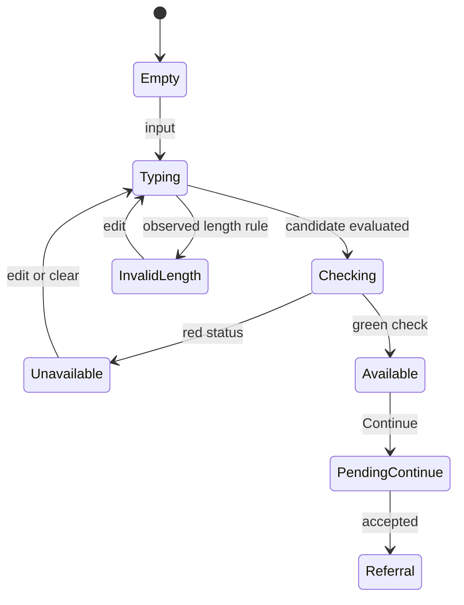
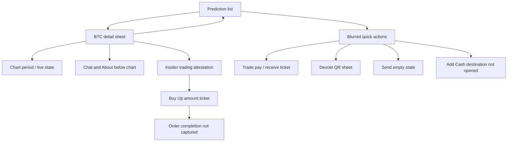

# R2 — Phantom

[Study index](README.md) · [Evidence gallery](gallery.html) · [Source metadata](evidence/R2/metadata.json)

Phantom contributes three especially useful references: continuously animated cartoon onboarding, validation-aware identity forms, and a floating quick-action fan over a strongly blurred live background. Its markets and predictions use compact cards, interactive charts and stacked transaction sheets.

## Complete timeline

| Time | Screen / action | Visible behavior and state | Evidence |
|---|---|---|---|
| 00–03.6 | Welcome | Black canvas, centered wordmark, more menu, animated purple ghost and market/sports objects, large centered copy, terms, Apple/Google pills and More options. | [P01](evidence/R2/screens/P01.jpg), [M05](evidence/motion/M05.mp4) |
| 03.9–05.8 | More options | Rightward page push into recovery phrase creation/import, private key import and Ledger connection. Four large rows under a small wallet illustration. No branch is entered. Back returns to welcome. | [P02](evidence/R2/screens/P02.jpg) |
| 08–19 | Google authorization | Google button shows Logging in… and becomes pending. Native browser/account picker/consent on accounts.google.com. Personal accounts obscured in retained evidence. | [P03](evidence/R2/screens/P03.jpg) |
| 20–33 | Provider return | connect.phantom.app browser surface with lavender three-dot spinner; then welcome still shows Logging in… while hero animation continues. This is async loading, not a thirteen-second entrance animation. | [P04](evidence/R2/screens/P04.jpg) |
| 34–41 | Choose username | Back, step indicator, help, cartoon avatar, title, explanatory copy, rounded @ input and trailing clear button. Keyboard appears, Continue stays above it. Unavailable/error state appears below the field. | [P05](evidence/R2/screens/P05.jpg) |
| 43–51 | Import username from X | Web surface loads, then says login to X is required. The user returns without completing X login/import. | [P06](evidence/R2/screens/P06.jpg) |
| 52–70 | Username validation | Multiple entries and clearing. Checking spinner → red unavailable; a separate “between 2 and 20 characters” error; eventually green availability check and enabled Continue. Continue then shows pending dots. | [P07](evidence/R2/screens/P07.jpg), [P08](evidence/R2/screens/P08.jpg) |
| 70.5–73.5 | Referral | Gift illustration, optional referral code, terms link, Skip at top right, empty field and disabled Continue. Skipped. | Onboarding optional branch: [P09](evidence/R2/screens/P09.jpg) |
| 74–78.5 | Face ID | Purple sculpted lock, “Unlock with a look,” Enable Face ID and Skip. Native permission followed by scan/check; another scan is visible around home entry, but its cause is not established. | [P10](evidence/R2/screens/P10.jpg) |
| 78.5–79.5 | Notifications | Native Allow / Don't Allow prompt. | [P11](evidence/R2/screens/P11.jpg) |
| 80–87 | Home | Explicit **Testnet Mode** banner, Account 1, balance placeholders, token fetch failure with Retry, Perps cards, sports prediction cards, watchlist and support actions. | [P12](evidence/R2/screens/P12.jpg) |
| 88–92 | Trade discovery | Hot Markets horizontal cards, live chat/avatar indicators, Explore Markets, favorites heart and category pills. Asset rows transition from skeletons to data. | [P13](evidence/R2/screens/P13.jpg) |
| 93–100 | Home revisit | Perps introduction, sports cards and watchlist. Horizontal content can change independently of top navigation. | [Overview 2](evidence/R2/overview-02.jpg) |
| 101–110 | Predict | Upcoming sports, BTC Up or Down chart/countdown, two-by-two five-minute market grid, soccer outcomes with probabilities and lower football section. | [P14](evidence/R2/screens/P14.jpg) |
| 111.2–123 | BTC prediction detail | Tall bottom sheet with handle, token, favorite/share controls, large updating price and target/countdown. Blank chart resolves into a line and red live endpoint. Period chips change chart state. Scroll reveals chat/about; Up/Down purchase actions stay anchored. | [P15](evidence/R2/screens/P15.jpg), [P16](evidence/R2/screens/P16.jpg), [M08](evidence/motion/M08.mp4) |
| 123.5–125 | Insider attestation | Small shield badge, legal copy, link and I agree on a second sheet over dimmed chart context. Acceptance leads to the purchase ticket. | [P17](evidence/R2/screens/P17.jpg) |
| 126–132 | Buy Up ticket | Large $0, inactive percentage chips, custom keypad and loading/skeleton asset/balance rows. No amount or successful order. | [P18](evidence/R2/screens/P18.jpg) |
| 133–136 | Dismiss detail | Return to the prediction list rather than onboarding/home reset. | [Overview 3](evidence/R2/overview-03.jpg) |
| 136.6–143 | Quick actions | Plus becomes ×; live page heavily blurs/dims. Four labelled lavender circle actions rise into a right-hand column: Send, Receive, Add Cash, Trade. Short stagger/scale/overshoot entrance. | [P19](evidence/R2/screens/P19.jpg), [M06](evidence/motion/M06.mp4), [dense frames](evidence/motion/M06-dense-1.jpg) |
| 143.3–146 | Trade ticket | Menu clears; tall modal raises into view. You Pay / You Receive, percentage shortcuts, large zero values, token/loading regions, custom keypad, settings/sliders and close. No swap. | [P20](evidence/R2/screens/P20.jpg), [M07](evidence/motion/M07.mp4) |
| 147–151 | Receive via menu | Menu revisited, then compact QR sheet. Solana **Devnet** identity dropdown, dotted white QR with center badge, Copy Address and Share. Results of copy/share not shown. | [P21](evidence/R2/screens/P21.jpg) |
| 152–157.5 | Send via menu | Menu revisited, then Send surface: brief recipient skeletons resolve to No recent sends, close/add-contact controls, money-and-paper-plane illustration, bottom username/wallet search and scan affordance. No recipient entered or transfer sent. | [P22](evidence/R2/screens/P22.jpg) |
| 157.5–159.327 | Close Send | Prediction list restored with its chart and five-minute market grid. | [Overview 3](evidence/R2/overview-03.jpg) |

## The welcome artwork is a layered cartoon

The purple ghost changes expression and blinks. A large black circular field carries a green rising arrow. BTC/ETH badges, Solana stripes, candlesticks, chat bubble, stars and sports imagery move around it. The sports object visibly changes between an orange basketball and a blue football-like form. These layers make the scene look alive while the authentication button is busy.

Most of this hero reads as **flat illustrated layers**, not a pair of 3D characters. Some badge shapes have shading. The later Face ID lock reads as sculpted/3D with soft highlights. The source renderer, animation format, rigs, and loop seams are unknown. A faithful asset brief should specify the layers and expressions, not merely request “a 3D crypto animation.”

## Username state machine

This diagram expresses observed states, not the original validation algorithm. Debounce duration, server API, uniqueness race handling, permitted character set and error after submission are unknown. The visible length rule is **2–20 characters**; it belongs to this reference app. The keyboard shifts the layout, with the primary action remaining reachable just above it. Validation feedback occupies a predictable place under the input instead of becoming a separate alert. The clear × removes the current input and associated state. X import is a distinct browser branch with its own login requirement.

## Quick-action geometry and blur contract

The dense inspection resolves the requested side/arc effect:

- At about **136.57 s**, the underlying page is still sharp and the plus is present.
- Around **136.60 s**, blur appears and Send begins emerging above the origin; lower actions are faint and clustered near the starting region.
- From **136.63–136.73 s**, Send travels furthest/first, Receive follows, then Add Cash and Trade separate upward. Scale and opacity increase. Send briefly reaches beyond its final position.
- By about **136.80 s**, the four actions are settled in a **vertical column**. The entrance occupies approximately **0.2–0.3 s**, with uncertainty from sampling and source encoding.

At the working 402 × 874 viewport, settled circles are approximately 48 units in diameter, centered near x=358, with around 72 units between centers. The column sits near the bottom/right, labels extend to its left, and the × sits below it. These are visual estimates, not original layout tokens. See [P19](evidence/R2/screens/P19.jpg).

The backdrop preserves live page colors and shapes but removes their legibility through substantial blur plus a darker scrim. The menu stays sharp and above that layer. The closed FAB has a lavender filled disc; the open × is visually simpler. Foreground labels are large and white, icons dark. Choosing Trade removes the fan/blur and presents a transaction sheet; closing that sheet restores the underlying page.

**Do not substitute a final semicircular radial menu and call it exact fidelity.** There is no demonstrated wide horizontal arc. The fan-like impression comes from staged upward displacement and scale. A curved trajectory can be a candidate adaptation only after comparing a reconstruction to the dense strip.

## Prediction and transaction hierarchy

The list includes different card families: large upcoming sports cards, a chart-driven BTC binary market, a two-by-two quick market grid and multi-outcome sports rows. The detail sheet preserves the market identity, target line, countdown and price interpretation. Price updates visibly change; the exact digit animation is not derived from source code. The chart initially lacks a path, then the line appears progressively over roughly a second; separate loading-to-data from navigation motion. Up/Down color and probability support a decision, while sticky purchase buttons stay outside the scrolling text.

The attestation is a separate interruption before an order ticket. Its competitor wording is reference copy, not an approved legal rule for Senryo. Buy Up, Trade and Send are different surfaces with different tasks. Reusing a generic bottom sheet is only faithful if it supports their separate scroll, keyboard, controls and dismissal behavior.

## Components that are easy to overlook

- **Persistent top navigation:** avatar and Home / Trade / Predict / Explore pills. The row can horizontally overflow; it is not the same pattern as Solflare's bottom tabs.
- **Bottom search dock:** translucent rounded Search Phantom field paired with the lavender plus. The dock remains associated with the discovery page, while transaction sheets replace/cover it.
- **Testnet banner:** unmistakable mode context. The receive sheet explicitly says Devnet. A reconstruction must not show these balances/addresses as mainnet.
- **Token failure card:** red explanatory copy inside the token region plus a Retry control. Keep both loading and failure layouts, including the balance placeholder.
- **Market card microdata:** overlapping chat avatars, green activity indicator/count, percentage badges, tiny asset imagery and favorites affordance.
- **Prediction detail tools:** favorite, share, countdown capsule, selected white chart-period chip, red live dot, Up/Down rows with probabilities/multipliers, chat presence count.
- **Form help:** small help button and compact onboarding step indicator; optional referral and Face ID have Skip, whereas Continue availability belongs to form state.
- **Receive identity selector:** network/address row is a dropdown, not just static text. It is visible but its alternatives are not opened.
- **Send empty-state search:** recipient entry is bottom anchored, with scanning and contact creation affordances. No-recents artwork is not an error.

## Capture limits

Recovery phrase/private key/Ledger branches, username help, full X import, denied permissions, Add Cash, favorites/share results, balance retry success, completed prediction/swap/send, recipient search results, contact creation and network switching are not captured. No text-password or passkey creation prompt appears. Exact font, blur radius, spring/easing parameters, haptics, chart library and illustration runtime are unknown.
