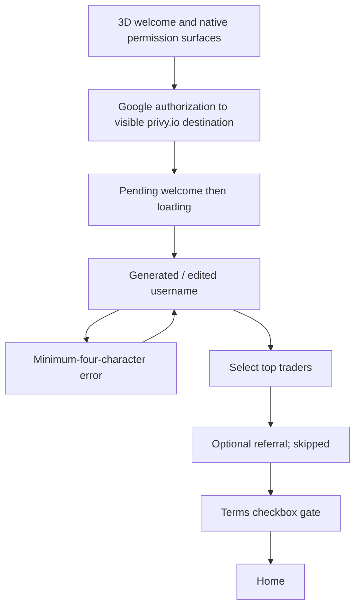
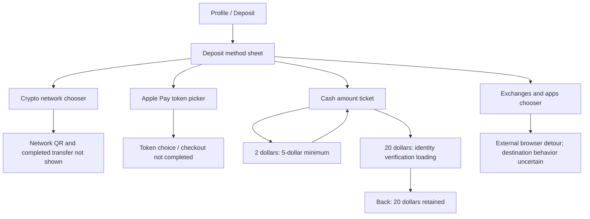

# R3 — Fomo

[Study index](README.md) · [Evidence gallery](gallery.html) · [Source metadata](evidence/R3/metadata.json)

Fomo is the richest flow reference. It connects onboarding, social discovery, profiles, several deposit methods, leaderboards and a perpetual trading ticket. Its strongest motion/layout patterns are the floating translucent navigation dock, collapsing home header, nested sheets, centered leverage ruler, and keyboard-aware risk controls.

## Complete timeline

| Time | Screen / action | Visible behavior and state | Evidence |
|---|---|---|---|
| 00–06 | Welcome and native permissions | Tracking permission is briefly visible; its choice is unclear. Native notification prompt follows. Navy/black welcome with violet lower glow, beveled/glass logo tile and two stylized 3D figures facing inward; white Apple and dark Google buttons. | [F01](evidence/R3/screens/F01.jpg), [M17](evidence/motion/M17.mp4) |
| 07–18 | Google authorization | Native browser/account picker/consent. Visible provider destination says **privy.io**. Account identifiers obscured in retained evidence. This is provider evidence, not proof of a full backend architecture. | [F02](evidence/R3/screens/F02.jpg) |
| 18–28 | Login return / loading | Welcome returns with Google spinner and unavailable actions, then a blank dark loading surface before onboarding. Network wait is separate from motion timing. | [F03](evidence/R3/screens/F03.jpg) |
| 29–41 | Create username | Back, centered mark, Skip, explanatory subtitle. Generated handle is present initially; clearing and typing produce a minimum-four-character error. Continue can appear available before submit-time validation; accepted candidate becomes pending. | [F04](evidence/R3/screens/F04.jpg), [F05](evidence/R3/screens/F05.jpg) |
| 42–45 | Follow top traders | Rank medals, avatar/name/handle, green P&L and follower count; first three checked, Show more and Continue. Later profile shows three following, consistent with this selection. | [F06](evidence/R3/screens/F06.jpg) |
| 46–47 | Referral | Empty field, Paste, “I don't have one,” Finish setup, native keyboard. Proceeds without a code. | [F07](evidence/R3/screens/F07.jpg) |
| 48–53 | Terms gate over home | Dimmed home behind a rounded sheet; checkbox and Terms / Privacy links. Continue initially inactive, then proceeds after acceptance. Token data loads behind the sheet. | [F08](evidence/R3/screens/F08.jpg) |
| 54–68 | Home / Tokens | $0 balance, 24h context, Deposit button. Weekly Top Trades/Hall of Fame horizontal P&L cards. Watchlist / Tokens / Perps New tabs; horizontally scrolling token categories and filter control. Category changes show textual loading and then rows. | [F09](evidence/R3/screens/F09.jpg), [F10](evidence/R3/screens/F10.jpg) |
| 67–73 | Perps and scrolling | All / Crypto / Stocks / Commodities / Indices pills. Dismissible long/short educational card, asset rows with leverage badges and volume. On scroll, large balance and promotion rows leave, compact logo/$0 stays, tabs remain near the top and dock remains floating. | [F11](evidence/R3/screens/F11.jpg), [F12](evidence/R3/screens/F12.jpg), [M09](evidence/motion/M09.mp4) |
| 77–89 | Hall of Fame position | Tall sheet: trader identity/Follow, token/Open badge, price, chart loading→green path with buy markers, large P&L card, invested/entry stats, share, thesis, engagement and transaction count. Sticky Deposit to Buy plus lightning affordance. | [F13](evidence/R3/screens/F13.jpg), [F14](evidence/R3/screens/F14.jpg) |
| 90–95 | Home restored | Dismisses the position sheet back to home. | [Overview 2](evidence/R3/overview-02.jpg) |
| 96–101 | Global feed | Global/Friends tabs and filter. Initially empty/loading, then pinned recap and trade/thesis posts with event verbs, linked assets, engagement controls and thread connectors. | [F15](evidence/R3/screens/F15.jpg) |
| 102–106 | Profile | Brief stale/generated name and zero-follow count before loaded identity/three following. Avatar edit, Add bio, Rewards, round utility controls, portfolio periods, empty positions and Apple Pay promotion. | [F16](evidence/R3/screens/F16.jpg), [M10](evidence/motion/M10.mp4) |
| 107.8–111 | Edit profile | Full page pushes from the right with rounded page corners during travel. Banner/avatar pencils, username/display name, Bio 0/160, connected Google row, Link X, eight-address disclosure, red Export keys and disabled Save changes. No edit, save, link or export is completed. | [F17](evidence/R3/screens/F17.jpg), [F18](evidence/R3/screens/F18.jpg), [M11](evidence/motion/M11.mp4) |
| 112–116 | Profile scroll | Apple Pay first-purchase promotion and large blue Deposit CTA. Deposit content can overlap the translucent dock in these frames; this is not evidence of an alternate blue dock theme. | [F19](evidence/R3/screens/F19.jpg) |
| 116.7–122 | Deposit method sheet | Short sheet with handle and four rich rows: Crypto, Apple Pay New, Debit, Exchanges and apps. Underlying profile dims. | [F20](evidence/R3/screens/F20.jpg), [M12](evidence/motion/M12.mp4) |
| 122.8–126 | Crypto networks | Child panel with explicit back, Deposit crypto and choose-network copy. Solana, Base, BNB Chain, Monad, Robinhood Chain, Arc, Hyperliquid, Ethereum. No network selected or QR shown. | [F21](evidence/R3/screens/F21.jpg), [M16](evidence/motion/M16.mp4) |
| 127–139 | Apple Pay token picker | Taller sheet, title and gift/free badge, search, actual token artwork with small blue check badges, prices/market cap/change. The checks are not chain logos; their verification policy is unestablished. Revisits and scrolls list; no token/purchase completed. | [F22](evidence/R3/screens/F22.jpg) |
| 140–150 | Debit → deposit cash | Numeric ticket, $20/$100/$250/$500 shortcuts, large $0 and custom keypad. $2 changes CTA to $5 minimum. $20 proceeds into pending verification. | [F23](evidence/R3/screens/F23.jpg), [F24](evidence/R3/screens/F24.jpg), [F25](evidence/R3/screens/F25.jpg) |
| 151–157 | Identity verification | Verify identity title, dark spinner then white embedded loading area. No verification success shown. Back returns to cash ticket with **$20 retained**, Verify identity button, fee line and Apple Pay payment-method selector. | [F26](evidence/R3/screens/F26.jpg), [F27](evidence/R3/screens/F27.jpg) |
| 156–165 | Exchanges/apps and external detour | Chooser for Cash App, Coinbase, Binance. A system browser then shows shijima.xyz; the exact triggering selection is unclear. Treat it as a recorded cross-app detour, not canonical Fomo funding content. | [F28](evidence/R3/screens/F28.jpg) |
| 166–177 | Profile → leaderboard/friends | Leaderboard with Clans New cards, All and 24h/7d/30d filters, Your rank, medals, P&L and tiny asset clusters. Friends 3 tab shows self, followed traders and recommendations with Follow actions. | [F29](evidence/R3/screens/F29.jpg), [F30](evidence/R3/screens/F30.jpg) |
| 178–187 | Home, feed, search | Perps list revisited; feed displays New activity pill. Search tabs All/Tokens/Perps/Traders/Clans, empty Recents, faded logo watermark and bottom search with Paste. No query entered. | [F31](evidence/R3/screens/F31.jpg) |
| 188–201 | ZEC market detail | Full-page push. Token identity/10x, price and red 24h change, open interest, history/favorite/share. Candlestick chart with current-price line/label, 15min control, period chips and chart-style icon. Holders, Feed and About inspected; chart is panned/reframed. Sticky Short/Long. | [F32](evidence/R3/screens/F32.jpg)–[F35](evidence/R3/screens/F35.jpg) |
| 201.5–204.8 | Eligibility | “Are you outside the United States” sheet, checkbox/terms, inactive→blue Continue→spinner. Accepted in the recording. This wording is reference content, not target legal guidance. | [F36](evidence/R3/screens/F36.jpg), [M13](evidence/motion/M13.mp4) |
| 204.9–218 | Order ticket / leverage | Tall sheet with handle, ZEC and open interest, live price/Market, big $0, horizontal leverage ruler, liquidation info, Add SL/TP, keypad/chart toggle, amount shortcuts, available balance and disabled slide-shaped action. Leverage moves from low multiples to 10x and back to 1x. | [F37](evidence/R3/screens/F37.jpg), [F38](evidence/R3/screens/F38.jpg), [M14](evidence/motion/M14.mp4) |
| 219–231 | Chart mode and style dialog | Chart replaces keypad region within the ticket. Embedded Symbol settings includes body/border toggles, green/red color choices, previous-close option, Cancel/OK. Later returns to keypad. Source chart vendor is unknown. | [F39](evidence/R3/screens/F39.jpg), [F40](evidence/R3/screens/F40.jpg) |
| 232–237 | Amount and insufficient funds | $10 margin, 1x→2x; leveraged size changes $10→$20 while main amount stays $10. Available balance remains $0. Bottom action reads Insufficient funds. Token quantity and liquidation estimate update. Order direction cannot be established confidently. | [F41](evidence/R3/screens/F41.jpg), [F42](evidence/R3/screens/F42.jpg) |
| 238–239.5 | Liquidation explanation | Small information sheet explaining possible automatic close/loss and moving liquidation price; Close action. No liquidation event. | [F43](evidence/R3/screens/F43.jpg) |
| 240–245 | Stop loss / take profit | Nested sheet with price and percent fields for both, potential P&L, clear and inactive Save changes. Focus opens native numeric keyboard and lifts the sheet. Stop-loss percentage suggestions shown. No entered value or saved risk settings. | [F44](evidence/R3/screens/F44.jpg), [F45](evidence/R3/screens/F45.jpg), [M15](evidence/motion/M15.mp4) |
| 245.5–247.525 | Dismiss ticket | Returns to ZEC About/chart surface. No order created. | [Overview 4](evidence/R3/overview-04.jpg) |

## Onboarding and identity

This sequence couples account identity and a starting social graph. The follow list uses rank and performance signals, checked choices and a Continue action. Do not flatten it into a decorative leaderboard: selection is part of onboarding. An initially generated username and later loaded profile name are visible. The brief stale profile display should be recorded as an observed imperfection, not reproduced as an ideal behavior. Submission, field validity and pending states are separate.

The welcome has a dark atmosphere with violet illumination, a glass-like tile around a beveled symbol, and two dimensional human figures framing the lower composition. They face inward with visible head/hand silhouettes. Preserve placement, lighting and relationship to the controls. Their appearance is 3D-like; the recording cannot distinguish a rigged render from prerendered or video-based artwork. A generic mascot placed in the center would change the reference substantially. Exact rigs, looping duration, renderer and source models are unknown.

## Home, scrolling and floating navigation

The home header has two scales: an expanded balance/deposit/featured-trades area and a compact identity/balance area after scrolling. Primary content tabs remain accessible. Secondary category pills scroll horizontally, while the data list scrolls vertically. The transitions have different jobs; do not animate all of them as a whole-screen slide.

The bottom dock is a five-item rounded capsule with translucent fill, a bright rim and a moving active region. Home, search, global feed, friends and profile are represented by icons/avatar. During navigation, the active icon grows/emphasizes and a bubble moves across the dock; content visible behind it appears distorted/softened. These are **glass-like visual observations**. The footage does not prove the OS API or implementation is Apple's Liquid Glass.

The dock floats above the screen edge and scrolling content passes behind it. In profile frames, a blue Deposit button can occupy the same visual band, making blue visible through/around the dock. Preserve the evidence of overlap in the audit, but a target design should decide whether to avoid that collision. Do not infer that the dock itself switches to blue.

## Funding is a branching stack, not one modal

The first sheet is compact and menu-like. The crypto child has a back arrow and a larger list. Apple Pay grows into a searchable asset picker. Debit leads to an amount-entry screen with its own validation and verification requirement. Exchanges/apps is another short selector. Those heights, headers and back relationships should be documented before choosing a sheet component.

For reconstruction, preserve the parent selection context when entering/leaving a child, including the $20 amount after the identity web surface. The identity surface changes from a dark loader to a white web area; that color discontinuity is provider content, not evidence for a new app theme. Its success/error states and provider are not established. The quote/free-offer copy is recording content and cannot become target business policy.

## Social and card families

| Family | Structure and states | Distinctive details |
|---|---|---|
| Hall of Fame / weekly trade card | Horizontal featured trader/position previews | Avatar, asset, large green return and rank/performance emphasis; leads to a richer position sheet. |
| Position detail card | Chart, summary, thesis, transactions | Chart is initially blank then populated; buy markers overlay the path. Summary separates P&L, amount, percent, invested and entry. Fixed funding CTA survives scrolling. |
| Feed event | Avatar + event verb + asset + time, engagement | Buy/Sell/Opened/Closed labels, threaded connector lines, thesis text and link styles, pinned recap and New activity pill. |
| Profile summary | Avatar/edit, identity/bio, utility actions, metrics | Skeleton/loaded states, period selector, no-position state, reward and deposit promotion. |
| Clan preview | Horizontal clan cards | Group name, member count and green P&L; distinct from individual ranking rows. |
| Leaderboard row | Rank/medal, avatar, identity, P&L, asset cluster | Your rank is a separate summary. Date filters and Friends selection change the comparison context. |
| Market row | Asset/logo, leverage badge, volume, price/change | Truncation and tiny data formatting matter; live color changes should not shift row alignment. |
| Follow selection row | Rank, avatar/name, performance, check | Onboarding selection is checked; recommendation rows use a Follow button. Different control semantics despite similar content. |

Like, reply, share, follow, ranking filters, clan destinations, profile history/settings/rewards, avatar/banner change, key export and address expansion are visible affordances where opened results are not captured. Keep this distinction in the ledger.

## Order ticket anatomy

Read this from top to bottom, because spacing and state dependencies make it usable:

1. **Context:** sheet handle, token logo/name, maximum leverage reference, open interest, price/change and Market affordance.
2. **Amount:** very large margin amount. Once entered, a smaller leveraged-size line appears above it. These values are not interchangeable.
3. **Leverage ruler:** horizontal graduated scale with central selected tick/value, blue selection and fading left/right edges. Sliding the scale changes the selected multiple. ZEC reaches 10x in this capture; other market limits must not be inferred from it.
4. **Risk context:** liquidation-price info at one side, Add SL/TP at the other. At zero/low state there can be placeholders; after amount/leverage change an estimate appears. The recording is not proof of the underlying pricing formula or trade direction.
5. **Entry-mode toggle:** two small icons swap the keypad region for an embedded candlestick chart. The rest of the ticket remains identifiable.
6. **Presets and entry area:** $10/$50/$100/$300 chips and custom decimal/backspace keypad in numeric mode. Chart mode has its own interaction controls/settings.
7. **Funding context:** available $0 and token quantity. The display responds to amount/leverage state rather than merely changing button text.
8. **Commit control:** wide slider-like pill with left chevrons. It reads Enter an amount or Insufficient funds in the captured disabled states. A draggable thumb, confirmation threshold, success animation and resulting position are **not demonstrated**.

The $10/2x example visibly produces a $20 leveraged-size label while preserving $10 as the entered margin. This is a useful fidelity acceptance check. It does not authorize copying calculation assumptions into Senryo.

## Risk sheet and keyboard behavior

The stop-loss/take-profit child groups each order type into price and percentage inputs, with projected result text, clear control and Save changes. Native keyboard focus changes the available height and moves the sheet upward. Percentage suggestions appear above the keyboard for stop loss (−10%, −15%, −25%, −50% in the capture). The parent order ticket remains behind the child. Closing the child and keyboard is a sequence; a brief keyboard linger is visible before the ticket is restored.

The custom amount keypad and native risk-input keyboard are **different input systems**. A faithful build should not replace both with one full-screen generic number pad. Focus order, dismissal, retained values and the parent ticket's state need explicit acceptance checks. Saving a stop loss, invalid prices/percentages, take-profit suggestions, preview calculations and active-position editing remain capture gaps.

## Reference imperfections and unknowns

The recording includes stale profile identity during loading, deposit/dock overlap, unresolved white identity-loader content, and an embedded chart styling dialog during ticket exploration. Record these honestly. A target design can improve them as an explicit adaptation, while preserving the intended journey. The external shijima.xyz browser detour is not a canonical Fomo screen.

No real deposit, crypto receive, KYC completion, Apple Pay authorization, trade, position opening/closing, saved risk order, share result, password setup or passkey creation appears. Sound, haptics, source fonts, chart SDK, blur/refraction implementation and spring parameters are unknown. Eligibility copy, chains, rankings and monetary figures are observations of this recording only.
