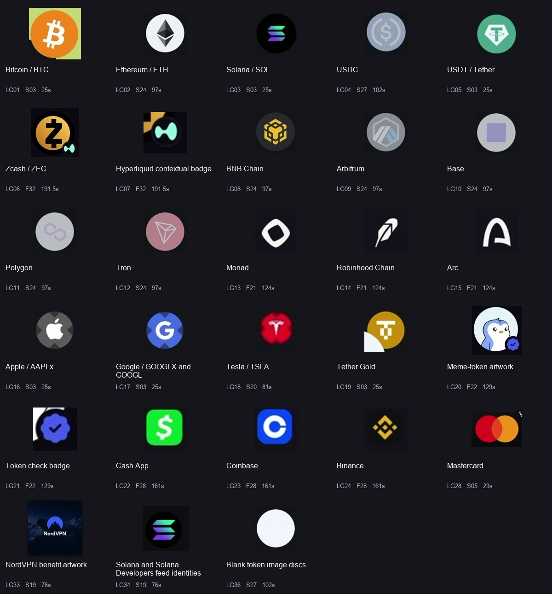

# Logos, asset identity and the small details that make this feel designed

[Study index](README.md) · [Feature inventory](09-feature-inventory.md) · [Redesign opportunities](10-redesign-opportunities.md) · [Structured identity register](asset-identity-register.json)

**Known assets, networks, companies and providers need their actual marks or artwork.** BTC gets the Bitcoin mark; USDC gets the USDC mark; a chain gets its recognizable chain identity; an exchange gets its own logo. A dollar glyph, generic coin, letter in a colored circle or component-library icon does not satisfy that requirement. This applies across discovery, detail, selectors, funding, order entry, activity and shareable output wherever that identity is present.

The recordings use identity as part of composition, not a decorative afterthought: logos orbit Phantom's character, sit around Solflare's trading mockup, occupy Fomo's network rows, and overlap asset discs as contextual badges. Merchant images, company marks, token artwork and human avatars provide variety that one generic icon family cannot.

These are **screen-recording evidence crops**, including dimmed and unresolved image states. They are not transparent originals, licensed production assets, or a verified current brand kit. The register contains 38 identity/artwork entries; some group related visible artwork and some document a missing asset or target design gap. Source timestamps are in [screen-index.json](screen-index.json).

## Distinguish the identities before selecting artwork

| Role | What belongs there | Recorded example | Frequent fidelity mistake |
|---|---|---|---|
| Asset | Canonical token artwork/mark and instrument label | BTC, SOL, USDC, USDT, ZEC, PENGU | Giving every row the same coin or dollar icon |
| Network | Chain mark plus explicit network/environment text | Monad, Base, Solana Devnet | Assuming token symbol alone identifies the receiving network |
| Venue/context | Actual venue or contextual mark, separate from asset | Small Hyperliquid-like mark attached to ZEC | Replacing the ZEC logo with the venue mark, or treating any badge as a chain |
| Underlying company | Company artwork with the actual instrument type retained | AAPLx, GOOGLX, TSLA | Showing company branding while dropping the tokenized/perp distinction |
| Provider | Named auth/payment/exchange provider and correct logo variant | Google, Apple, Apple Pay, Coinbase | Using a generic person, card, bank or wallet glyph as the provider identity |
| Person/group | Actual avatar or authored default identity | Trader faces, Fomo profile avatar, clan cards | Repeating one stock user silhouette across all people |
| Status | Meaningful check, rank, Open, New or leverage badge | Blue token checks; 10x; rank medals | Presenting a check as a network logo or as independently proven verification |
| Action | A readable functional icon | Search, star, share, back, close, info | Forcing a brand logo into a utility control |
| Illustration | Authored scene/object with a clear purpose | Piggy bank, mirror, ghost, shield, flag | Replacing all artwork with component-library symbols |

Generic **action** icons are appropriate. They must not stand in for an identifiable entity. Cartoon content can contain a generic chart arrow, chat bubble or sports ball: those objects are illustration layers, not missing asset logos.

## Exact observations and corrections

1. **Fomo's network picker uses monochrome brand silhouettes.** [F21](evidence/R3/screens/F21.jpg) places the chain name on the left and a small white chain mark on the right. Solana stripes, Base's square, BNB's cube, Monad's hollow tilted form, Robinhood's feather, Arc's arch and Ethereum's diamond remain recognizable. Authentic identity does not mean every surface must use a full-color disc.
2. **The Apple Pay token picker has blue check badges.** [F22](evidence/R3/screens/F22.jpg) shows PENGU, TRUMP, PEPE, WIF and other actual token artwork, with blue scalloped checks at the lower right. Their meaning/verification authority is not established. They are not chain logos. The earlier Fomo timeline description has been corrected.
3. **ZEC has two separate identities.** [F32](evidence/R3/screens/F32.jpg) has the large gold/black Zcash mark and a small mint mark matching the shape of the Hyperliquid row in F21. The blue 10x chip is a third, textual risk/market-limit badge. Keep all three roles distinct; the footage does not establish the underlying venue/network data model.
4. **Some token images genuinely remain unresolved in the retained frame.** [S27](evidence/R1/screens/S27.jpg) has loaded SOL/USDC/USDT marks alongside blank white discs for other rows. The cause could be loading, failed fetch or absent metadata. Record that honestly; it does not make blank discs the preferred final design. S24, by comparison, has recognizable marks throughout its chain list.
5. **Provider variants depend on their surface.** Phantom uses black Apple and Google marks on lavender pills; Solflare shows a multicolor Google G on its light social button. Do not force every Google mark to multicolor, or tint every mark to the app's accent. Obtain an appropriate authentic variant and verify usage before implementation.
6. **Company identity and account-provider identity are different contexts.** Apple's mark appears in the AAPLx illustration; Google appears as GOOGLX/GOOGL artwork. Their authentication buttons and Apple Pay payment wordmark have separate jobs. Naming and labels must distinguish those jobs.
7. **Payment artwork carries real network identity.** [S05](evidence/R1/screens/S05.jpg) integrates the Solflare wordmark and red/yellow Mastercard circles into the black card. The reflective object beside it is a freestanding circular mirror with a stand. These details should be described as actual objects, not “a shiny blob.” They do not establish Senryo's card network or issuance capabilities.
8. **Identity continues beyond token rows.** [S19](evidence/R1/screens/S19.jpg) has NordVPN benefit artwork, organization avatars and a branded promotion. [F28](evidence/R3/screens/F28.jpg) uses Cash App, Coinbase and Binance marks. [F29](evidence/R3/screens/F29.jpg) combines human avatars with small asset clusters and rank badges.

## Asset-delivery contract for an implementation agent

Maintain a registry keyed by **the actual entity**, not just a display ticker. A token key should include the relevant network and canonical contract/mint or authoritative native-asset ID; a perp should retain its venue and market ID. Similar tickers and company-associated instruments must not accidentally share unrelated artwork.

For every known entity, record:

- Entity ID, display name/symbol, role, instrument type and network/venue where applicable.
- Source URL or supplied asset location, provenance, usage/permission information, retrieval date and file hash.
- Actual image/vector paths and supported variants: full color, light/dark monochrome where appropriate, wordmark versus symbol, disc versus uncontained mark.
- View box/aspect ratio, optical-size treatment, transparent background, padding and contrast surface. Preserve the mark's shape; do not stretch it to fill a square.
- Primary artwork, secondary contextual badge and separately modelled status badges. Do not paint a venue or check into the main asset file if it needs to change independently.
- Loading, failed fetch and genuinely unidentified states. Keep readable identity text. A neutral labelled fallback can identify missing artwork without pretending to be the official logo.

Acquire production artwork from the entity's first-party brand resources or authoritative token/instrument metadata and check it against the entity being shown. Screenshots, remembered logo shapes, a search result thumbnail or a generated approximation are not production provenance. No external logo downloads or brand-permission checks were performed in this reference study.

Known artwork should resolve consistently across market row → detail → ticket → review → activity. Preserve each surface's intended scale and layering rather than forcing one oversized disc everywhere. Small logos require optical checks at actual mobile size; a technically correct SVG can still become unreadable if the padding or contrast is wrong.

## Senryo implications verified in this workspace

[marks.ts](../../../packages/tokens/src/marks.ts) defines theme-independent identity **colors**. A color map is useful but does not supply the actual artwork. [EngineMarketRow](../../../apps/mobile/src/features/markets/MarketRow.tsx) currently renders text identity, venue/session/leverage, sparkline and price data without rendering an asset image in that component. These are focused source observations, not a claim that the entire app has no logos or that any UI has been visually audited here.

The adaptation should add actual identity artwork to the relevant journeys while preserving the approved D2 system. BTC orange and USDC blue should not become gold simply because the surrounding Senryo surface uses gold. Where a monochrome identity is appropriate, use a legitimate variant with its silhouette intact. Changes to surrounding card, glow, rim, paper/lacquer and artwork materials can provide the creative color expression.

Gold, silver and FX need a different treatment from issued coins. **XAU commodity exposure is not Tether Gold**, and XAG has no universal issuer logo. Define original, consistent commodity artwork and explicit instrument labels rather than borrowing an unrelated token's identity. AUSD, USDC, supported chains and venue integrations need their own authentic marks when those actual entities are shown. This study has not delivered or authenticated those target production assets.

## Acceptance criteria

- Every known displayed asset/network/provider resolves to the correct actual mark or artwork. No generic coin, dollar, hexagon or app-accent initial silently passes as a known entity.
- The identity remains correct through the full journey, including modal selectors, risk inputs, loading recovery and receipts.
- Asset, chain, venue and verification/status badges are correctly distinguished and legible at actual viewport size.
- Label, symbol, artwork and network/venue are bound to the same record. Contract/mint identity matters when tickers collide.
- Dark/light surfaces and reduced-motion mode retain readable identity; color alone is insufficient to distinguish networks.
- Share/card output retains actual instrument identity and honest product mode/status. Competitor card brands, rewards and support lists cannot become target capabilities through decoration.

## Registered evidence

<!-- IDENTITY_TABLE -->

| ID / identity | Role | Visible treatment | Evidence |
|---|---|---|---|
| LG01 Bitcoin / BTC | asset and network | Orange disc, white Bitcoin mark; hero badge and network row; Crypto asset versus deposit network depends on context | [S03 · 25s](evidence/R1/screens/S03.jpg), [S24 · 97s](evidence/R1/screens/S24.jpg), [P01 · 2s](evidence/R2/screens/P01.jpg), [P15 · 115s](evidence/R2/screens/P15.jpg) |
| LG02 Ethereum / ETH | asset and network | Faceted diamond in pale disc on Solflare; white small diamond on Fomo; Distinct identity with surface-dependent treatment | [S24 · 97s](evidence/R1/screens/S24.jpg), [F21 · 124s](evidence/R3/screens/F21.jpg), [P01 · 2s](evidence/R2/screens/P01.jpg) |
| LG03 Solana / SOL | asset and network | Gradient stripes in asset discs; solid white stripes in Fomo selector; Keep chain context and Devnet/Testnet wording separate | [S03 · 25s](evidence/R1/screens/S03.jpg), [S27 · 102s](evidence/R1/screens/S27.jpg), [F21 · 124s](evidence/R3/screens/F21.jpg), [P21 · 150s](evidence/R2/screens/P21.jpg) |
| LG04 USDC | asset | Circle/dollar mark with surrounding arcs; pale-blue/gray in this frame; Stablecoin identity, not a generic dollar currency icon | [S27 · 102s](evidence/R1/screens/S27.jpg), [S20 · 81s](evidence/R1/screens/S20.jpg) |
| LG05 USDT / Tether | asset | Recognizable Tether symbol; green disc/diamond context; Different asset from USDC despite dollar denomination | [S03 · 25s](evidence/R1/screens/S03.jpg), [S27 · 102s](evidence/R1/screens/S27.jpg) |
| LG06 Zcash / ZEC | asset | Gold circle with black distinctive Z; Hyperliquid mark overlaps lower right; Primary market asset, not venue | [F32 · 191.5s](evidence/R3/screens/F32.jpg), [F37 · 206s](evidence/R3/screens/F37.jpg) |
| LG07 Hyperliquid contextual badge | venue or network context | Mint/white small mark on ZEC; solid white in network selector; Contextual badge identity visible; exact data model not supplied | [F32 · 191.5s](evidence/R3/screens/F32.jpg), [F21 · 124s](evidence/R3/screens/F21.jpg) |
| LG08 BNB Chain | network | Yellow cube-style mark on dark disc; white cube on Fomo; Deposit network | [S24 · 97s](evidence/R1/screens/S24.jpg), [F21 · 124s](evidence/R3/screens/F21.jpg) |
| LG09 Arbitrum | network | Hexagonal shield-style mark with diagonal blue/gray forms; Deposit source network | [S24 · 97s](evidence/R1/screens/S24.jpg) |
| LG10 Base | network | Square within pale circular field on Solflare; white square on Fomo; Recorded square variant; do not replace by remembered older shape | [S24 · 97s](evidence/R1/screens/S24.jpg), [F21 · 124s](evidence/R3/screens/F21.jpg) |
| LG11 Polygon | network | Purple linked forms on pale disc; Deposit source network | [S24 · 97s](evidence/R1/screens/S24.jpg) |
| LG12 Tron | network | White angular triangular line mark on pink/red disc; Deposit source network | [S24 · 97s](evidence/R1/screens/S24.jpg) |
| LG13 Monad | network | White tilted hollow rounded diamond; Deposit network | [F21 · 124s](evidence/R3/screens/F21.jpg) |
| LG14 Robinhood Chain | network | White feather silhouette; Row identifies a chain; do not infer a brokerage integration | [F21 · 124s](evidence/R3/screens/F21.jpg) |
| LG15 Arc | network | White stylized A/arch; Deposit network | [F21 · 124s](evidence/R3/screens/F21.jpg) |
| LG16 Apple / AAPLx | underlying company artwork | White Apple silhouette on gray segmented disc in AAPLx tutorial; Asset association does not mean ownership of Apple stock | [S03 · 25s](evidence/R1/screens/S03.jpg), [S20 · 81s](evidence/R1/screens/S20.jpg) |
| LG17 Google / GOOGLX and GOOGL | underlying company artwork | White G on blue tutorial disc; multicolor G in market tile; Underlying/company mark distinct from authentication provider role | [S03 · 25s](evidence/R1/screens/S03.jpg), [S20 · 81s](evidence/R1/screens/S20.jpg) |
| LG18 Tesla / TSLA | underlying company artwork | White Tesla silhouette on red circular field; Underlying/company identity; instrument type still needs a label | [S20 · 81s](evidence/R1/screens/S20.jpg) |
| LG19 Tether Gold | asset | White Tether-like gold mark on ochre disc; Issued gold token is different from generic XAU commodity exposure | [S03 · 25s](evidence/R1/screens/S03.jpg) |
| LG20 Meme-token artwork | asset artwork | PENGU penguin, PEPE frog, WIF dog, TRUMP/MELANIA portraits and other distinct imagery; Each token retains actual artwork; never give all the same coin glyph | [F22 · 129s](evidence/R3/screens/F22.jpg), [F10 · 64s](evidence/R3/screens/F10.jpg), [S20 · 81s](evidence/R1/screens/S20.jpg), [P13 · 90s](evidence/R2/screens/P13.jpg) |
| LG21 Token check badge | status badge | Blue scalloped disc with check overlapping lower right; Check shape observed; status policy/verification authority unverified | [F22 · 129s](evidence/R3/screens/F22.jpg), [F10 · 64s](evidence/R3/screens/F10.jpg) |
| LG22 Cash App | funding provider | Bright green square with white dollar-style Cash App mark; Provider identity; logo is more specific than a generic cash icon | [F28 · 161s](evidence/R3/screens/F28.jpg) |
| LG23 Coinbase | funding provider | Blue square containing white C mark; Provider identity; selector shown, completed integration unknown | [F28 · 161s](evidence/R3/screens/F28.jpg) |
| LG24 Binance | funding provider | Yellow multi-diamond mark on dark field; Exchange/provider identity | [F28 · 161s](evidence/R3/screens/F28.jpg) |
| LG25 Apple authentication | authentication provider | Black Apple silhouette on Phantom lavender button; contrasting variant on other surfaces; Sign-in choice, distinct from stock row and Apple Pay wordmark | [P01 · 2s](evidence/R2/screens/P01.jpg), [S07 · 35s](evidence/R1/screens/S07.jpg), [S08 · 39s](evidence/R1/screens/S08.jpg), [F01 · 4s](evidence/R3/screens/F01.jpg) |
| LG26 Google authentication | authentication provider | Multicolor G on Solflare social button; monochrome black G on Phantom lavender button; Preserve approved variant and contrast; no forced recoloring to app accent | [S07 · 35s](evidence/R1/screens/S07.jpg), [S08 · 39s](evidence/R1/screens/S08.jpg), [P01 · 2s](evidence/R2/screens/P01.jpg), [F01 · 4s](evidence/R3/screens/F01.jpg) |
| LG27 Apple Pay | payment provider | Apple plus Pay wordmark/copy in payment context; Payment route is distinct from Apple account authentication | [F22 · 129s](evidence/R3/screens/F22.jpg), [F27 · 156.8s](evidence/R3/screens/F27.jpg), [F19 · 114s](evidence/R3/screens/F19.jpg) |
| LG28 Mastercard | card network | Overlapping red and yellow circles on black card artwork; Reference card artwork; not proof Senryo has this card network | [S05 · 29s](evidence/R1/screens/S05.jpg), [S16 · 70s](evidence/R1/screens/S16.jpg) |
| LG29 Solflare mark / wordmark | reference app brand | Yellow/black wordmark, embossed shield, reflective flag mark; Brand appears integrated into sculpture and materials | [S01 · 18s](evidence/R1/screens/S01.jpg), [S02 · 22s](evidence/R1/screens/S02.jpg), [S05 · 29s](evidence/R1/screens/S05.jpg), [S13 · 63s](evidence/R1/screens/S13.jpg) |
| LG30 Phantom mark / ghost | reference app brand and character | Purple expressive ghost, cartoon avatar and sculpted lock; Character is authored artwork; do not replace with a generic ghost emoji | [P01 · 2s](evidence/R2/screens/P01.jpg), [P05 · 36s](evidence/R2/screens/P05.jpg), [P10 · 74.5s](evidence/R2/screens/P10.jpg) |
| LG31 Fomo mark | reference app brand | Beveled glass tile, white header mark, avatar disc, faded search watermark; Coherent brand repeats at different scales/materials | [F01 · 4s](evidence/R3/screens/F01.jpg), [F09 · 57s](evidence/R3/screens/F09.jpg), [F16 · 105s](evidence/R3/screens/F16.jpg), [F31 · 186s](evidence/R3/screens/F31.jpg) |
| LG32 Trader avatars and asset clusters | person or group identity | Individual photos/cartoon avatars, overlap clusters, ranks and small asset imagery; People, assets and rank medals are separate identity/status roles | [F06 · 44s](evidence/R3/screens/F06.jpg), [F09 · 57s](evidence/R3/screens/F09.jpg), [F13 · 81s](evidence/R3/screens/F13.jpg), [F29 · 171s](evidence/R3/screens/F29.jpg), [F30 · 176s](evidence/R3/screens/F30.jpg), [P13 · 90s](evidence/R2/screens/P13.jpg) |
| LG33 NordVPN benefit artwork | merchant/provider artwork | Branded mountain image and NordVPN mark with cashback row; Benefit provider identity, not a generic merchant/shop icon | [S19 · 76s](evidence/R1/screens/S19.jpg) |
| LG34 Solana and Solana Developers feed identities | organization avatar | Solana gradient logo; developer variant carries small Developers text; Organization avatar distinct from network destination | [S19 · 76s](evidence/R1/screens/S19.jpg) |
| LG35 Onramper provider handoff | provider identity in copy | Provider named in introduction; web quote has its own surface; Visible provider attribution; logo file/variant not established by this register | [S28 · 106s](evidence/R1/screens/S28.jpg), [S29 · 112s](evidence/R1/screens/S29.jpg), [S30 · 115s](evidence/R1/screens/S30.jpg) |
| LG36 Blank token image discs | unresolved image state | sUSDC, USD1, WIF, BOME, PENGU rows have empty white discs in retained frame; Do not claim logos loaded; exact cause (loading/failure/missing asset) unknown | [S27 · 102s](evidence/R1/screens/S27.jpg) |
| LG37 Utility control symbols | functional iconography | Search, back, share, star, close, sliders, info, keypad/chart controls; Generic icons are appropriate for actions; they do not identify a token or chain | [P19 · 138s](evidence/R2/screens/P19.jpg), [F32 · 191.5s](evidence/R3/screens/F32.jpg), [F44 · 241s](evidence/R3/screens/F44.jpg), [S20 · 81s](evidence/R1/screens/S20.jpg) |
| LG38 Gold / silver / FX target artwork | target identity design gap | Reference has issued Tether Gold; no target XAU/XAG/FX artwork supplied; Create consistent original commodity/FX artwork; no single universal issuer logo; this is an adaptation, not an observed Senryo asset | [S03 · 25s](evidence/R1/screens/S03.jpg) |
