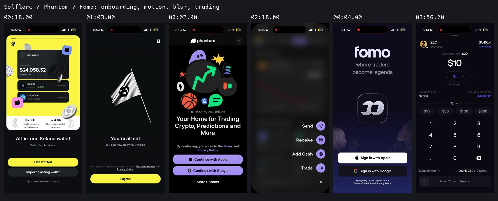

# Three-app fidelity study — 30 September 2026

This is a reference breakdown for redesign work and for any agent that needs to reconstruct the recorded experiences. It covers screens, flows, state changes, cards, sheets, navigation, blur, actual asset/chain/provider identity, illustrated assets, 3D artwork, and motion. It does not implement a redesign.

**Identity is a fidelity requirement:** known assets and providers use their actual logos/artwork, including BTC, USDC, chains, companies, exchanges and human avatars. Generic utility icons do not substitute for these identities. The expanded registers contain **38 identity/artwork entries, 116 feature/behavior entries and 18 concrete redesign opportunities** alongside the original 97 screens, 18 motion clips and 44 component briefs.

**The most useful combination:** Solflare for expressive onboarding and wallet education; Phantom for the blurred quick-action fan and market detail hierarchy; Fomo for nested funding sheets, a floating glass navigation dock, social trading cards, and the leverage/order ticket. Treat each as a coherent interaction system before mixing patterns.

## Open the evidence

- [Interactive evidence gallery](gallery.html): 97 readable screen captures, 18 replayable motion clips, search, app filters, slow playback, and frame stepping.
- [Solflare: onboarding, wallet, cards, receive, bridge, buy](01-solflare.md)
- [Phantom: authentication, validation, prediction, blur menu, trade, receive, send](02-phantom.md)
- [Fomo: social onboarding, navigation, funding, social surfaces, perpetual order ticket](03-fomo.md)
- [Motion, materials, illustration, and 3D asset breakdown](04-motion-and-assets.md)
- [Component inventory and future-agent handoff](05-components-and-agent-handoff.md)
- [Logos, entity identity, provider variants and missing-image states](08-logos-and-identity.md)
- [Complete recorded feature inventory: usernames, funding, leverage, social and more](09-feature-inventory.md)
- [Concrete redesign opportunities, original artwork and color direction](10-redesign-opportunities.md)
- [Capture gaps and additional recordings to make](06-capture-gaps.md)
- Machine-readable evidence: [screen index](screen-index.json), [motion index](motion-index.json), [identity register](asset-identity-register.json), [feature inventory](feature-inventory.json), [fidelity ledger](reference-ledger.json).
- [Inspection and validation record](07-validation.md).

The gallery works as a local HTML file or through a local HTTP server. All its assets are local. Markdown guides provide the detailed meaning that a screenshot alone cannot convey.

## Reference authority and provenance

The supplied recordings are the authority for **what is visible in these sessions**. Their content takes precedence over recollection of how the apps usually work. Identification comes from visible wordmarks and interface copy. No app source code, original design file, animation rig, component package, or backend implementation was supplied.

| ID | Visible app | Supplied local file | Duration | Source evidence |
|---|---|---|---:|---|
| R1 | Solflare | `ScreenRecording_09-30-2026 20-02-13_1.MP4` | 118.270 s | [Metadata and SHA-256](evidence/R1/metadata.json) |
| R2 | Phantom | `ScreenRecording_09-30-2026 20-04-41_1.MP4` | 159.327 s | [Metadata and SHA-256](evidence/R2/metadata.json) |
| R3 | Fomo | `ScreenRecording_09-30-2026 20-10-56_1.MP4` | 247.525 s | [Metadata and SHA-256](evidence/R3/metadata.json) |

All originals are under `/Users/abu/Downloads/`. Total footage: **8 minutes 45 seconds**. Source resolution is **1206 × 2622**, portrait HEVC, variable frame rate. Source-average rates are approximately 53.3, 53.7, and 59.8 fps. A 402 × 874 logical viewport is a useful working approximation, inferred by dividing by three; it does not identify the phone model or establish actual OS layout units.

### Inspection method

1. Locally decode the complete timelines at two samples per second: 237 / 319 / 495 frames, **1,051 inspection samples**.
2. Visually inspect the complete timelines using contact sheets at four-second intervals and complementary sheets offset by two seconds. Use intermediate half-second samples for short-lived states.
3. Inspect 18 targeted transitions with denser strips and retain silent replayable clips. Inspect Phantom's quick-action entrance at 30 samples per second to resolve the stagger and settled geometry.
4. Use local Apple Vision OCR as a supporting tool for small copy, validation states, and inventory completeness. Visual inspection takes precedence over OCR errors.
5. Retain 97 selected frames at 804 × 1748, nine overview sheets, and motion evidence at 402 × 874. Private inspection caches stay outside the repository.

Times in the guides are relative to the **start of each source file**, not wall-clock time. Frame anchors and measured durations are approximate. Screen recordings cannot establish GPU frame time, touch coordinates, original easing functions, spring constants, or the exact animation library. Delays that include login/network work are not motion durations. The encoded excerpts are resized derivatives, not untouched originals.

### Privacy and audio

The originals were not changed or uploaded. Retained Google account screens obscure personal accounts. Profile captures obscure the connected email; M11 obscures the band through which it moves. Unrelated home-screen/app-switcher content is omitted in overview evidence. These masks affect layout inspection inside the masked regions; do not use them as reference UI.

The audio streams are effectively silent in inspection. There is no reliable evidence of sound design or haptic patterns. No recovery phrase or private key was displayed. The six-digit passcode remains masked; the guide does not reconstruct it. Wallet addresses, market figures, rankings, and marketing claims are recording examples, not verified current facts or target product data.

## What fidelity means here

Use three evidence labels throughout:

- **Observed:** the screen or transition is visible. The gallery anchors it to a recording and time.
- **Inferred:** a likely interaction or implementation interpretation; explicitly labelled, never promoted to a requirement without review.
- **Unknown / capture gap:** a branch, result, source technology, or rule is not shown.

Separate **visible affordance** from **completed behavior**. A “Share” button does not prove the share sheet. A recovery option does not prove seed phrase handling. A slide-shaped order control does not prove a successful slide confirmation. Tutorial artwork of a settings menu does not establish the real settings flow.

The machine ledger uses Exact / Adapted / Additive / Blocked / Excluded as **proposed reference treatments**, not implementation claims. Exact means preserve the demonstrated sequence and geometry for a reference reconstruction. Adapted means the same interaction purpose may be fitted to the target brand or product. Blocked means capture is insufficient. Excluded marks unrelated system detours or accidental behavior that should not become a target requirement. No component has been built by this study.

## Findings that should guide the redesign

1. **Onboarding is an experience, not just forms.** Solflare changes color, material, illustration, and depth while keeping the action area stable. Phantom's cartoon keeps moving while authentication is pending. Fomo introduces identity and social follows before the home feed.
2. **Overlay treatments carry meaning.** Phantom's quick actions use strong blur and crisp floating foreground controls. Solflare and Fomo funding selectors mostly dim the underlying screen. Full-page pushes, tall transaction sheets, small choice sheets, and native browser/permission surfaces behave differently.
3. **The “arc” needs precise interpretation.** Phantom's four quick actions rise and scale out with a stagger and a small overshoot. They settle into a vertical right-side list, not a semicircular radial menu. Preserve the fan-like entrance, live backdrop blur, labels, and close transformation. A literal radial arc would be an added design choice. See [M06](evidence/motion/M06.mp4) and the [dense strip](evidence/motion/M06-dense-1.jpg).
4. **State fidelity matters as much as appearance.** The recordings include unavailable usernames, a length error, a bridge failure, missing tokens in testnet mode, minimum deposit validation, unresolved identity loading, and insufficient funds. Those states belong in a reconstruction.
5. **Small navigation details make the experience feel continuous.** Fomo collapses its header during scrolling and preserves the floating dock. Nested deposit screens provide an explicit back path. Cash input survives a return from identity verification. Phantom restores the prediction list after dismissal.
6. **Not all animated art is 3D.** Solflare uses metallic coins, shield, card, piggy-bank, and cloth-flag imagery. Fomo uses two dimensional, 3D-looking figures and a glass logo tile; the source could be rendered or video-based. Phantom's welcome is primarily a layered 2D cartoon with moving badges and expressions; its Face ID lock has depth.
7. **Authentication is not interchangeable.** Solflare visibly sets and confirms a six-digit passcode. Face ID permission and scans are visible. Google authorization is visible in Phantom and Fomo. A text-password flow and a passkey creation prompt are **not captured**.
8. **Logos have semantic roles and surface-specific variants.** Fomo uses white recognizable chain silhouettes, colored exchange marks, actual token artwork and separate status checks. ZEC's asset mark, small Hyperliquid context and 10x chip convey three different things. Preserve those roles instead of scattering generic coin icons. See the [identity guide](08-logos-and-identity.md).
9. **Inventory features before deciding additions.** The [116-entry register](09-feature-inventory.md) distinguishes observed actions, uncompleted controls, advertised benefits and missing outcomes. Senryo already plans many trade/funding/security features; social usernames/follows/clans and launch fiat purchases require separate product decisions.

## Fit with this repository

The current Senryo design plan identifies **D2 Desk** as the approved direction and a shared token source. See [stage 01](../../plan/stage-01-brand-design.md). This study adds a behavioral reference layer; it does not silently replace D2, change financial rules, add chains, copy competitors' eligibility wording, or authorize a new design implementation.

Before implementation, select which documented patterns are Exact, which are Adapted to Senryo, and which are out of scope. Keep the entire user journey—including state transitions and recovery—attached to the component choice. The [agent handoff](05-components-and-agent-handoff.md#copyable-agent-brief) provides a ready-to-use brief.
